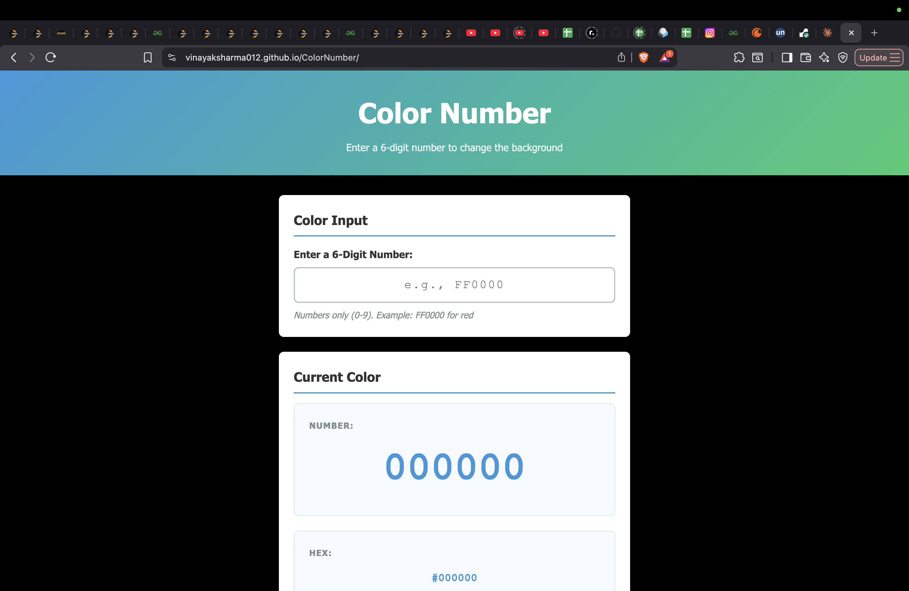
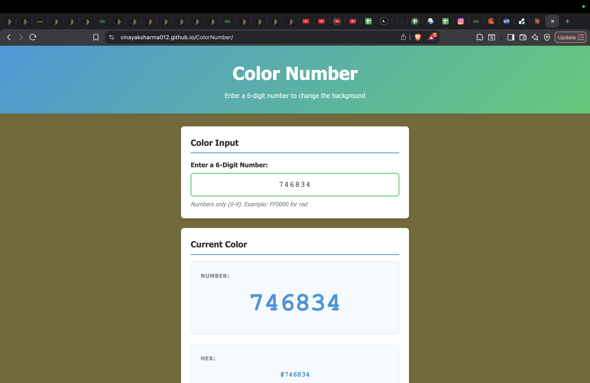
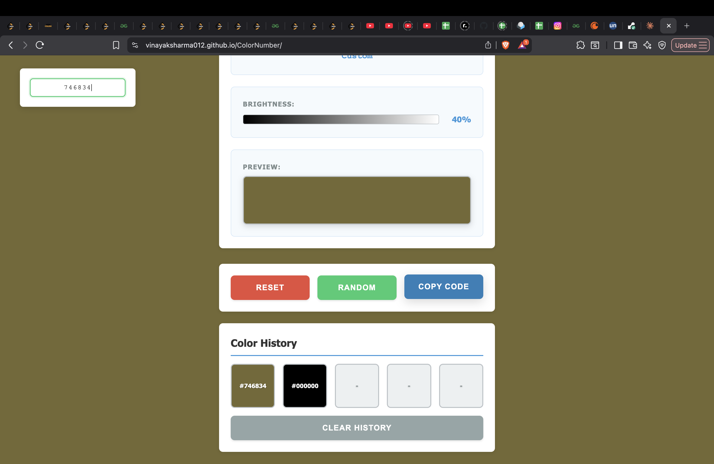

# 🎨 ColorNumber - Background Color Generator

A simple project that changes the background color based on the 6-digit number you enter. Built with HTML, CSS, and JavaScript.

**Live Demo:** https://vinayaksharma012.github.io/ColorNumber/

---

## 🎨 UI Preview







---

## ✨ Features

- Enter any 6-digit number to change the background color
- Real-time validation as you type
- Display color in multiple formats (number, hex, RGB)
- Reset button to go back to black
- Generate random colors
- Copy color code to clipboard
- Smooth animations
- Works on mobile, tablet, and desktop

---

## 🛠️ Tech Stack

- HTML5 (semantic markup)
- CSS3 (Grid, animations, responsive)
- Vanilla JavaScript (no frameworks)

---

## 📖 How to Use

1. Clone the repository:
```bash
git clone https://github.com/VinayakSharma012/ColorNumber.git
cd ColorNumber
```

2. Open `index.html` in your browser

3. Enter a 6-digit number (0-9 and A-F) and see the magic!

---

## 🎮 How It Works

1. Type a 6-digit number (like `FF0000` for red)
2. Background changes instantly to that color
3. See the color in three formats:
   - Number format
   - Hex format (#FF0000)
   - RGB format (rgb(255, 0, 0))

**Buttons:**
- **Reset** - Back to black background
- **Random** - Generate a random color
- **Copy** - Copy the hex code

---

## 📁 Project Structure

```
ColorNumber/
├── index.html    - HTML structure
├── styles.css    - All styling
├── script.js     - JavaScript logic
└── README.md     - This file
```

---

## 🌐 Browser Support

Works on:
- Chrome
- Firefox
- Safari
- Edge
- Mobile browsers

---

## 💡 What I Learned

- HTML5 semantic elements
- CSS Grid layout
- CSS animations and transitions
- JavaScript event handling and DOM manipulation
- Input validation in real-time
- Responsive design
- Git and GitHub workflow

---

## 🔗 Links

- **GitHub:** https://github.com/VinayakSharma012/ColorNumber
- **Live Demo:** https://vinayaksharma012.github.io/ColorNumber/

---

**Enjoy! 🎨**
